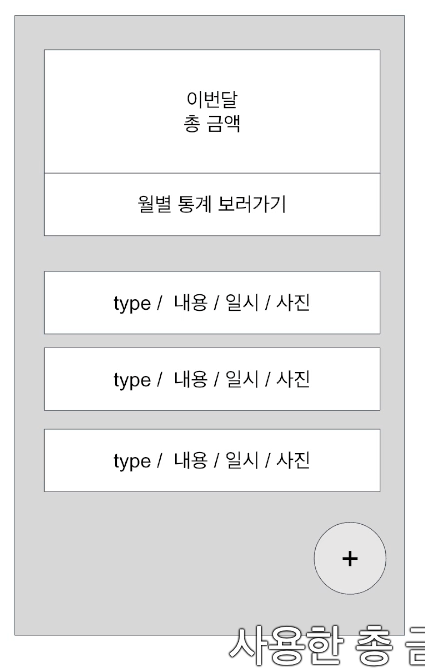
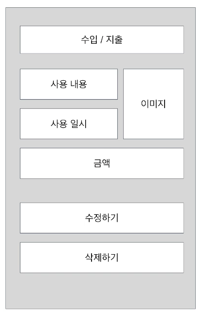
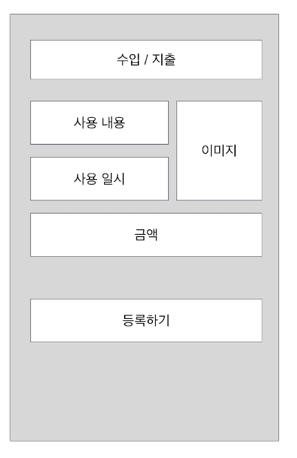
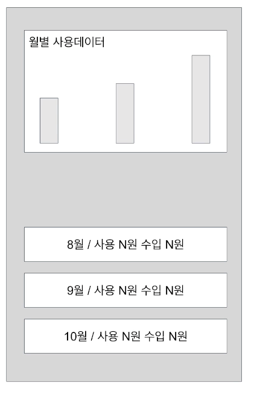
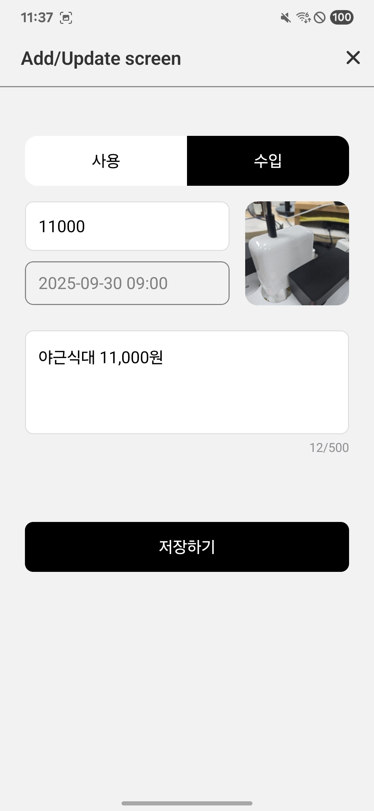

# 가게부 APP

로컬 DB 기반의 개인 가계부 앱입니다.

## 📱 프로젝트 개요

가계부 작성과 월별 분석 기능을 제공하는 모바일 앱입니다.

### 요구사항

| 홈                                                  | 수정                                                  | 추가                                               | 월간그래프                                             |
| --------------------------------------------------- | ----------------------------------------------------- | -------------------------------------------------- | ------------------------------------------------------ |
|  |  |  |  |

### 주요 기능

- 수입/지출 내역 등록 및 관리
- 월별 수입/지출 통계 및 차트 시각화
- 카메라를 통한 영수증 사진 첨부
- 달력 기반 일정 선택

### 화면

| 메인                       | 추가/수정 | 월별통계 | 카메라 |
|--------------------------|-------|------|-----|
|  ||||

## 🛠 기술 스택

- **Framework**: React Native 0.81.4
- **Language**: TypeScript 5.8.3
- **Navigation**: React Navigation 7.1.17
- **Database**: SQLite (react-native-sqlite-storage)
    - 거래 내역 저장
    - 사진 경로 저장
    - 오프라인에서도 동작

- **Charts**: React Native Chart Kit
- **Camera**: React Native Vision Camera 4.7.2
- **Camera Roll**: React Native Camera Roll 7.10.2
- **Icons**: React Native Vector Icons 10.3.0

## 프로젝트 구조

```
src/
├── components/          # 공통 컴포넌트
├── designsystem/        # 디자인 시스템 컴포넌트
├── data/               # 데이터 모델
├── hooks/              # 커스텀 훅
├── navigations/        # 네비게이션 설정
├── screens/            # 화면 컴포넌트
│   ├── main/           # 메인 화면
│   ├── monthly/        # 월별 통계 화면
│   ├── addUpdate/      # 추가/수정 화면
│   ├── detail/         # 상세 화면
│   ├── takePhoto/      # 사진 촬영 화면
│   └── calendarSelect/ # 날짜 선택 화면
└── utils/              # 유틸리티 함수
```

## 주요 화면

1. **메인 화면** (`MainScreen`)
    - 최근 거래 내역 목록
    - 총 수입/지출 요약
    - ||

```ts
const useMain = () => {
    const {getList, getMonthlyAverage} = useAccountBookHistoryDb();
    const [list, setList] = useState<AccountBookHistory[]>([]);
    const [average, setAverage] = useState<{ month: number; data: number[] }[]>(
        [],
    );
    const fetchList = useCallback(async () => {
        setList(await getList());
        const monthlyAverage = await getMonthlyAverage();
        setAverage(monthlyAverage);
    }, [getList, getMonthlyAverage]);

    useFocusEffect(
        useCallback(() => {
            fetchList();
        }, [fetchList]),
    );
...
}
```

2. **추가/수정 화면** (`AddUpdateScreen`)

    - 거래 내역 입력/수정
    - 사진 첨부 기능

   ||

   ```ts
     const { insertItem, updateItem } = useAccountBookHistoryDb();
     const navigation = useRootNavigation<'Add' | 'Update'>();
     const route = useRootRoute<'Add' | 'Update'>();
     const [item, setItem] = useState<AccountBookHistory>(
       route.params?.item ??
         ({
           type: '사용',
           price: 0,
           comment: '',
           date: 0,
           createdAt: 0,
           updatedAt: 0,
           photoUrl: null,
         } as AccountBookHistory),
     );

     const onPressType = useCallback<(type: AccountBookHistory['type']) => void>(
       type => {
   			...
         setItem(prevState => ({ ...prevState, type }));
       },
       [route.name],
     );

     const onPressSave = useCallback(() => {
       console.log('onPressSave item:', item);
       if (route.name === 'Add') {
         insertItem(item)
           .then(() => {
             navigation.goBack();
           })
           .catch(error => {
             Alert.alert('저장 실패', error.message, [
               {
                 text: '확인',
                 onPress: () => {},
               },
             ]);
           });
       } else if (route.name === 'Update') {
         updateItem(item)
           .then(() => {
             route.params?.onChangeData(item);
             navigation.goBack();
           })
           .catch(error => {
             Alert.alert('수정 실패', error.message, [
               {
                 text: '확인',
                 onPress: () => {},
               },
             ]);
           });
       }
     }, [insertItem, item, route.name, navigation, updateItem, route.params]);

     const incomeColorStyle = useMemo(() => {
       return item.type === '수입'
         ? {
             backgroundColor: 'black',
             borderColor: 'black',
           }
         : {
             backgroundColor: 'white',
             borderColor: 'gray',
           };
     }, [item.type]);

   ```

3. **월별 통계 화면** (`MonthlyScreen`)

    - 월별 수입/지출 차트
    - 상세 거래 내역

   |

   ```ts
   const useMonthly = () => {
    ...
     const [average, setAverage] = useState<{ month: number; data: number[] }[]>(
      [],
    );
    const { getMonthlyAverage } = useAccountBookHistoryDb();
    const getAverage = useCallback(async () => {
       setAverage(await getMonthlyAverage());
     }, [getMonthlyAverage]);

     useEffect(() => {
       getAverage();
    }, [getAverage]);
   ...
   }

   ```

    - useAccountBookHistoryDb

   ```ts
   const useAccountBookHistoryDb = () => {
     ...
     const openDB = useCallback<() => Promise<SQLiteDatabase>>(async () => {...} )

     const insertItem = useCallback(async ( item: Omit<AccountBookHistory, 'id'>): Promise<AccountBookHistory> => {...}

     const updateItem = useCallback( async (item: AccountBookHistory): Promise<AccountBookHistory> => {...}

        * // 반환값: [
        * //   { month: 0, data: [100000, 200000] }, // 1월: 사용 10만원, 수입 20만원
        * //   { month: 1, data: [150000, 180000] }, // 2월: 사용 15만원, 수입 18만원
        * //   { month: 2, data: [80000, 220000] }   // 3월: 사용 8만원, 수입 22만원 (3월 1일~15일까지)
        * // ]
     const getMonthlyAverage = useCallback<
         () => Promise<MonthlyAverage[]>
       >(async (): Promise<MonthlyAverage}[]> => {...}
     ...
   }
   ```

4. **사진 촬영 화면** (`TakePhotoScreen`)

    - 영수증 사진 촬영
    - 갤러리에서 선택

   ||

   ```ts
   const useTakePhoto = () => {
     // Camera 컴포넌트를 제어하기 위한 ref
     const cameraRef = useRef<Camera>(null);
     // 디바이스에 연결된 모든 카메라 목록 가져오기
     const devices = useCameraDevices();
     // 후면 카메라를 찾아서 선택
     const device = devices.find(d => d.position === 'back') as CameraDevice;
     // 카메라 권한 확인
     const { hasPermission } = useCameraPermission();

     useEffect(() => {
       Camera.requestCameraPermission();
     }, []);

     const takePhoto = useCallback(async () => {
       try {
         // 카메라 ref가 없으면 종료
         if (!cameraRef.current) return;
         // 사진 촬영 실행
         const result = await cameraRef.current?.takePhoto();
         if (result) {
           // Android는 'file://' 접두사 필요, iOS는 불필요
           const path = `${Platform.OS === 'android' ? 'file://' : ''}${
             result.path
           }`;
           // 촬영한 사진을 디바이스 갤러리의 'MoneyManager' 앨범에 저장
           const saveAssetResult = await CameraRoll.saveAsset(path, {
             type: 'photo',
             album: 'MoneyManager',
           });
           // 저장된 사진의 URI를 콜백으로 전달
           route.params?.onTakePhoto(saveAssetResult.node.image.uri);
           // 사진 촬영 화면 닫기
           navigation.goBack();
         }
       } catch (error) {
         console.log('onPressTakePhoto error', error);
       }
     }, [route.params, navigation]);
   };
   ```

5. 달력 기반 일정 선택
    - 날짜 선택
      ||

      ```ts
      const onDayPress: (time: number) => {
          route.params.onSelectDay(time);
          navigation.goBack();
      }
      ```

## 기타

- SQLite 사용법 강의와는 달라 에러를 찾는데 예상 외로 많은 시간이 소요

    - AS-IS

    ```ts
      const db:SQLiteDatabase = await openDB();
      db.executeSql(...Query..)
    ```

    - TO-BE

    ```ts
      const db:SQLiteDatabase = await openDB();
      db.transaction(transaction => {
      	transaction.executeSql(...Query..) 
      }
    ```

- 요구사항을 다 구현하지 않음(누락)
    - 삭제 기능
    - 월별 사용 데이터 하단 월별 금액
