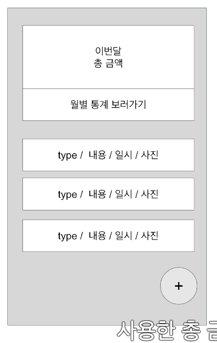
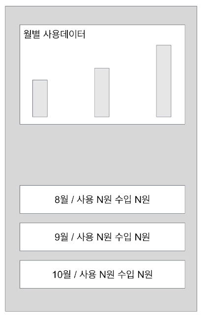
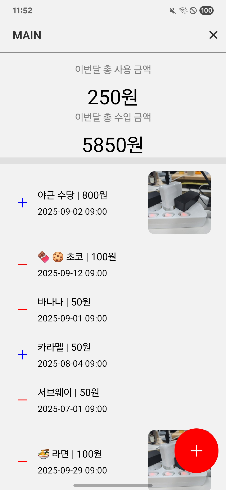
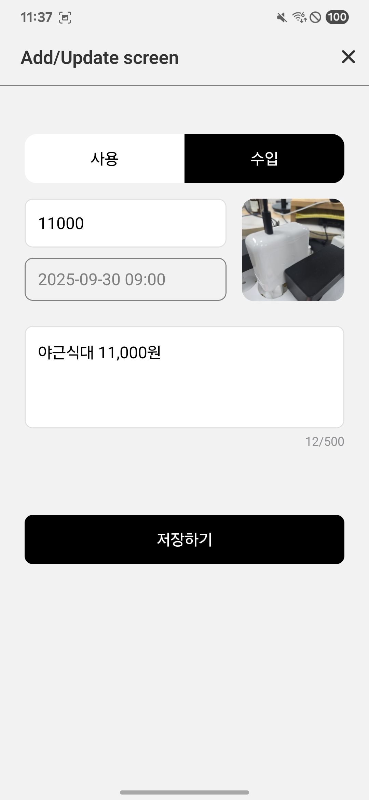
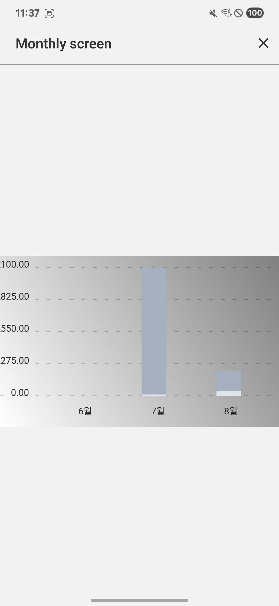
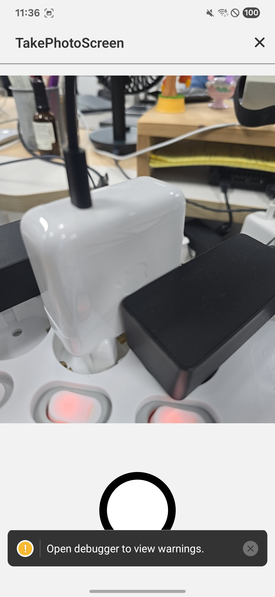
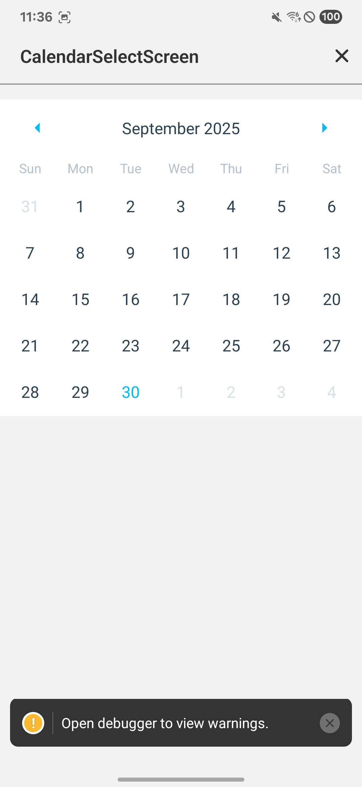

## 추가학습
### 유틸리티 타입

#### Omit - 특정 속성 제외
```ts
interface User {
  id: number;
  name: string;
  email: string;
  password: string;
}

// 특정 속성 제외
type PublicUser = Omit<User, 'password'>;
// { id: number; name: string; email: string; }

type UserWithoutId = Omit<User, 'id' | 'password'>;
// { name: string; email: string; }
```

#### Pick - Omit의 반대
```ts
interface User {
  id: number;
  name: string;
  email: string;
  password: string;
}

// 특정 속성만 선택
type PublicUser = Pick<User, 'id' | 'name' | 'email'>;
// { id: number; name: string; email: string; }
```
#### Partial - 모든 속성을 선택적으로
```ts
type PartialUser = Partial<User>;
// { id?: number; name?: string; email?: string; password?: string; }

// React Native에서 업데이트 함수에 유용
const updateUser = (updates: Partial<User>) => {
  // 일부 필드만 업데이트 가능
};
```
#### Required - 모든 속성을 필수로
```ts
interface OptionalProps {
  title?: string;
  subtitle?: string;
}

type RequiredProps = Required<OptionalProps>;
// { title: string; subtitle: string; }
```

#### Record - 키-값 쌍 타입 생성
```ts
  type UserRoles = Record<string, boolean>;
  const userRoles: UserRoles = {
    admin: true,
    user: true,
    guest: true,
  };

  type StatusMap = Record<'loading' | 'success' | 'error', string>;
  const statusMap: StatusMap = {
    loading: 'Loading...',
    success: 'Success!',
    error: 'false',
  };

```

#### React Native에서 실용적인 사용 예시
```ts
// 컴포넌트 Props 정의
interface ButtonProps {
  title: string;
  onPress: () => void;
  disabled?: boolean;
  style?: ViewStyle;
  testID?: string;
}

// 1. 특정 props 제외하고 새 타입 생성
type SimpleButtonProps = Omit<ButtonProps, 'style' | 'testID'>;

// 2. 특정 props만 선택
type ButtonActions = Pick<ButtonProps, 'onPress' | 'disabled'>;

// 3. 모든 props를 선택적으로 (기본값 제공용)
type ButtonDefaults = Partial<ButtonProps>;

// 4. API 응답과 폼 데이터 구분
interface ApiUser {
  id: number;
  name: string;
  email: string;
  createdAt: string;
}

type UserFormData = Omit<ApiUser, 'id' | 'createdAt'>;
// { name: string; email: string; }

type UserUpdate = Partial<UserFormData>;
// { name?: string; email?: string; }
```

#### 조합해서 사용하기
```ts
// 복합 유틸리티 타입 사용
interface FullScreenProps {
  navigation: any;
  route: any;
  title: string;
  showBackButton: boolean;
  headerStyle?: ViewStyle;
}

// navigation, route 제외하고 나머지는 선택적으로
type ScreenConfigProps = Partial<Omit<FullScreenProps, 'navigation' | 'route'>>;

// 또는 Pick + Partial 조합
type HeaderProps = Partial<Pick<FullScreenProps, 'title' | 'showBackButton' | 'headerStyle'>>;

// Required + Omit 조합
type RequiredUserData = Required<Omit<ApiUser, 'id'>>;
// { name: string; email: string; createdAt: string; } - 모두 필수
```

#### 실제 React Native 컴포넌트에서 활용
```ts
// TextInput 확장 예시
interface CustomInputProps extends Omit<TextInputProps, 'onChangeText'> {
  label: string;
  onChangeText: (text: string, isValid: boolean) => void; // 파라미터 추가
}
// TouchableOpacity 확장 예시
interface CustomButtonProps extends Omit<TouchableOpacityProps, 'onPress'> {
  title: string;
  onPress: () => Promise<void> | void;
  loading?: boolean;
}
```


### Bodoc 에서의 Thunk 예시

```ts
/**
   * 생체 인증 사용 여부 confirm 함수
   * @param type
   */
  const showConfirmBio = (type) => {
    const successFn = () => {
      dispatch(makeBioData());
      dispatch(userSetLock({ useBio: Toggle.ON }));
      dispatch(userSetLock({ useEasyPassword: Toggle.ON }));
      navigate(currentTab);
    };
    ...
  }
```
```ts
export const makeBioData =
  (reset = true) =>
  async (dispatch, getState) => {
    try {
      let keyExist = await keysExist();
      if (keyExist) {
        if (!reset) {
          dispatch({
            type: ACTION_TYPES.USER_BIO_DONE,
          });
          return;
        }

        let proHWDelete = deleteKeys();
        let proSEVERDelete = apiDeleteKey({});
        await Promise.all([proHWDelete, proSEVERDelete]);
      }
    } catch (e) {
      dispatch({
        type: ACTION_TYPES.USER_BIO_ERROR,
        error: ErrorCode.E_BIO_BAD_KEY,
      });
    }
    dispatch({
      type: ACTION_TYPES.USER_BIO_REQ,
    });
  }
```

# 가게부 APP

로컬 DB 기반의 개인 가계부 앱입니다.

## 📱 프로젝트 개요

가계부 작성과 월별 분석 기능을 제공하는 모바일 앱입니다.

### 요구사항

| 홈                                                  | 수정                                                  | 추가                                               | 월간그래프                                             |
| --------------------------------------------------- | ----------------------------------------------------- | -------------------------------------------------- | ------------------------------------------------------ |
|  |  |  |  |

### 주요 기능

- 수입/지출 내역 등록 및 관리
- 월별 수입/지출 통계 및 차트 시각화
- 카메라를 통한 영수증 사진 첨부
- 달력 기반 일정 선택

### 화면

| 메인                       | 추가/수정 | 월별통계 | 카메라 |
|--------------------------|-------|------|-----|
|  ||||

## 🛠 기술 스택

- **Framework**: React Native 0.81.4
- **Language**: TypeScript 5.8.3
- **Navigation**: React Navigation 7.1.17
- **Database**: SQLite (react-native-sqlite-storage)
    - 거래 내역 저장
    - 사진 경로 저장
    - 오프라인에서도 동작

- **Charts**: React Native Chart Kit
- **Camera**: React Native Vision Camera 4.7.2
- **Camera Roll**: React Native Camera Roll 7.10.2
- **Icons**: React Native Vector Icons 10.3.0

## 프로젝트 구조

```
src/
├── components/          # 공통 컴포넌트
├── designsystem/        # 디자인 시스템 컴포넌트
├── data/               # 데이터 모델
├── hooks/              # 커스텀 훅
├── navigations/        # 네비게이션 설정
├── screens/            # 화면 컴포넌트
│   ├── main/           # 메인 화면
│   ├── monthly/        # 월별 통계 화면
│   ├── addUpdate/      # 추가/수정 화면
│   ├── detail/         # 상세 화면
│   ├── takePhoto/      # 사진 촬영 화면
│   └── calendarSelect/ # 날짜 선택 화면
└── utils/              # 유틸리티 함수
```

## 주요 화면

1. **메인 화면** (`MainScreen`)
    - 최근 거래 내역 목록
    - 총 수입/지출 요약
    - ||

```ts
const useMain = () => {
    const {getList, getMonthlyAverage} = useAccountBookHistoryDb();
    const [list, setList] = useState<AccountBookHistory[]>([]);
    const [average, setAverage] = useState<{ month: number; data: number[] }[]>(
        [],
    );
    const fetchList = useCallback(async () => {
        setList(await getList());
        const monthlyAverage = await getMonthlyAverage();
        setAverage(monthlyAverage);
    }, [getList, getMonthlyAverage]);

    useFocusEffect(
        useCallback(() => {
            fetchList();
        }, [fetchList]),
    );
...
}
```

2. **추가/수정 화면** (`AddUpdateScreen`)

    - 거래 내역 입력/수정
    - 사진 첨부 기능

   ||

   ```ts
     const { insertItem, updateItem } = useAccountBookHistoryDb();
     const navigation = useRootNavigation<'Add' | 'Update'>();
     const route = useRootRoute<'Add' | 'Update'>();
     const [item, setItem] = useState<AccountBookHistory>(
       route.params?.item ??
         ({
           type: '사용',
           price: 0,
           comment: '',
           date: 0,
           createdAt: 0,
           updatedAt: 0,
           photoUrl: null,
         } as AccountBookHistory),
     );

     const onPressType = useCallback<(type: AccountBookHistory['type']) => void>(
       type => {
        ...
         setItem(prevState => ({ ...prevState, type }));
       },
       [route.name],
     );

     const onPressSave = useCallback(() => {
       console.log('onPressSave item:', item);
       if (route.name === 'Add') {
         insertItem(item)
           .then(() => {
             navigation.goBack();
           })
           .catch(error => {
             Alert.alert('저장 실패', error.message, [
               {
                 text: '확인',
                 onPress: () => {},
               },
             ]);
           });
       } else if (route.name === 'Update') {
         updateItem(item)
           .then(() => {
             route.params?.onChangeData(item);
             navigation.goBack();
           })
           .catch(error => {
             Alert.alert('수정 실패', error.message, [
               {
                 text: '확인',
                 onPress: () => {},
               },
             ]);
           });
       }
     }, [insertItem, item, route.name, navigation, updateItem, route.params]);

     const incomeColorStyle = useMemo(() => {
       return item.type === '수입'
         ? {
             backgroundColor: 'black',
             borderColor: 'black',
           }
         : {
             backgroundColor: 'white',
             borderColor: 'gray',
           };
     }, [item.type]);

   ```

3. **월별 통계 화면** (`MonthlyScreen`)

    - 월별 수입/지출 차트
    - 상세 거래 내역

   |

   ```ts
   const useMonthly = () => {
    ...
     const [average, setAverage] = useState<{ month: number; data: number[] }[]>(
      [],
    );
    const { getMonthlyAverage } = useAccountBookHistoryDb();
    const getAverage = useCallback(async () => {
       setAverage(await getMonthlyAverage());
     }, [getMonthlyAverage]);

     useEffect(() => {
       getAverage();
    }, [getAverage]);
   ...
   }

   ```

    - useAccountBookHistoryDb

   ```ts
   const useAccountBookHistoryDb = () => {
     ...
     const openDB = useCallback<() => Promise<SQLiteDatabase>>(async () => {...} )

     const insertItem = useCallback(async ( item: Omit<AccountBookHistory, 'id'>): Promise<AccountBookHistory> => {...}

     const updateItem = useCallback( async (item: AccountBookHistory): Promise<AccountBookHistory> => {...}

        * // 반환값: [
        * //   { month: 0, data: [100000, 200000] }, // 1월: 사용 10만원, 수입 20만원
        * //   { month: 1, data: [150000, 180000] }, // 2월: 사용 15만원, 수입 18만원
        * //   { month: 2, data: [80000, 220000] }   // 3월: 사용 8만원, 수입 22만원 (3월 1일~15일까지)
        * // ]
     const getMonthlyAverage = useCallback<
         () => Promise<MonthlyAverage[]>
       >(async (): Promise<MonthlyAverage}[]> => {...}
     ...
   }
   ```

4. **사진 촬영 화면** (`TakePhotoScreen`)

    - 영수증 사진 촬영
    - 갤러리에서 선택

   ||

   ```ts
   const useTakePhoto = () => {
     // Camera 컴포넌트를 제어하기 위한 ref
     const cameraRef = useRef<Camera>(null);
     // 디바이스에 연결된 모든 카메라 목록 가져오기
     const devices = useCameraDevices();
     // 후면 카메라를 찾아서 선택
     const device = devices.find(d => d.position === 'back') as CameraDevice;
     // 카메라 권한 확인
     const { hasPermission } = useCameraPermission();

     useEffect(() => {
       Camera.requestCameraPermission();
     }, []);

     const takePhoto = useCallback(async () => {
       try {
         // 카메라 ref가 없으면 종료
         if (!cameraRef.current) return;
         // 사진 촬영 실행
         const result = await cameraRef.current?.takePhoto();
         if (result) {
           // Android는 'file://' 접두사 필요, iOS는 불필요
           const path = `${Platform.OS === 'android' ? 'file://' : ''}${
             result.path
           }`;
           // 촬영한 사진을 디바이스 갤러리의 'MoneyManager' 앨범에 저장
           const saveAssetResult = await CameraRoll.saveAsset(path, {
             type: 'photo',
             album: 'MoneyManager',
           });
           // 저장된 사진의 URI를 콜백으로 전달
           route.params?.onTakePhoto(saveAssetResult.node.image.uri);
           // 사진 촬영 화면 닫기
           navigation.goBack();
         }
       } catch (error) {
         console.log('onPressTakePhoto error', error);
       }
     }, [route.params, navigation]);
   };
   ```

5. 달력 기반 일정 선택
    - 날짜 선택
      ||

      ```ts
      const onDayPress: (time: number) => {
          route.params.onSelectDay(time);
          navigation.goBack();
      }
      ```

## 기타

- SQLite 사용법 강의와는 달라 에러를 찾는데 예상 외로 많은 시간이 소요

    - AS-IS

    ```ts
      const db:SQLiteDatabase = await openDB();
      db.executeSql(...Query..)
    ```

    - TO-BE

    ```ts
      const db:SQLiteDatabase = await openDB();
      db.transaction(transaction => {
        transaction.executeSql(...Query..) 
      }
    ```

- 요구사항을 다 구현하지 않음(누락)
    - 삭제 기능
    - 월별 사용 데이터 하단 월별 금액

<br>
<br>
<br>

# 추가 학습
## useFocusEffect 와 useCallback 를 함께 사용하는 이유?

`useFocusEffect`는 의존성 배열을 받지 않고 콜백 함수 자체가 변경되었는지를 비교합니다. `useCallback`으로 감싸지 않으면 매 렌더링마다 새로운 함수가 생성되어 불필요한 재실행이 발생합니다.

```ts
const useMain = () => {
  const {getList, getMonthlyAverage} = useAccountBookHistoryDb();
  const [list, setList] = useState<AccountBookHistory[]>([]);

  // fetchList를 useCallback으로 메모이제이션
  const fetchList = useCallback(async () => {
    setList(await getList());
    const monthlyAverage = await getMonthlyAverage();
    setAverage(monthlyAverage);
  }, [getList, getMonthlyAverage]);

  //매 렌더링마다 새로운 함수가 생성되어 fetchList가 재실행됨
  useFocusEffect(() => {
    fetchList();
  });

  useFocusEffect(
    useCallback(() => {
      fetchList();
    }, [fetchList])
  );
};
```
- useCallback() 을 사용하지 않으면 나타나는 현상
```
[1단계] 컴포넌트 렌더링
    ↓
[2단계] () => { fetchList(); } 함수가 생성
    ↓
[3단계] useFocusEffect가 "콜백 함수가 바뀌었네?" 감지
    ↓
[4단계] useFocusEffect가 새 콜백 실행
    ↓
[5단계] fetchList() 실행 → setList(), setAverage() 호출
    ↓
[6단계] 상태 변경 → 컴포넌트 리렌더링
    ↓
[다시 1단계로...] 무한 루프!

```
- useCallback() 을 사용했을 때
```
[1단계] 컴포넌트 렌더링 
  ↓
[2단계] useFocusEffect의 useCallback 실행 
  ↓
[3단계] fetchList 실행 
  ↓
[4단계] 상태 변경으로 렌더링 
  ↓
[5단계] fetchList가 바뀌지 않았으므로 useCallback이 실행되지 않음 
```


## useState의 초기값 설정을 useState 객체 생성시에 하면 안되는 이유?

복잡한 객체 리터럴을 직접 넣으면 매 렌더링마다 새로운 객체가 생성되어 불필요한 메모리 할당이 발생합니다. 하지만 이는 성능에 큰 영향을 주지 않으며, 주로 가독성과 유지보수를 위해 사용합니다.

```ts
const useAddUpdate = () => {
  const route = useRootRoute<'Add' | 'Update'>();

  // ⚠️ 객체 리터럴이 매 렌더링마다 생성됨 (하지만 실제 성능 영향은 미미함)
  const [item, setItem] = useState<AccountBookHistory>(
    route.params?.item ?? {
      type: '사용',
      price: 0,
      comment: '',
      date: 0,
      createdAt: 0,
      updatedAt: 0,
      photoUrl: null,
    }
  );

  // ✅ 더 나은 방법: 기본값을 상수로 분리
  const DEFAULT_ITEM: Omit<AccountBookHistory, 'id'> = {
    type: '사용',
    price: 0,
    comment: '',
    date: 0,
    createdAt: 0,
    updatedAt: 0,
    photoUrl: null,
  };

  const [item2, setItem2] = useState<AccountBookHistory>(
    route.params?.item ?? DEFAULT_ITEM
  );
};

// 📝 참고: 함수 호출이나 무거운 연산은 lazy initialization 사용 필요
const [data, setData] = useState(() => heavyComputation());
```

## type 과 interface의 차이

### 공통점
- 객체 타입 정의
- extends로 확장 가능

### 차이점
| 특징 | interface | type |
|------|-----------|------|
| 확장 방법 | extends | & (intersection) |
| 선언 병합 | 가능 (같은 이름으로 여러 번 선언 시 자동 병합) | 불가능 |
| Union/Intersection | 불가능 | 가능 |
| Primitive 타입 | 불가능 | 가능 |

```ts
// interface: 선언 병합
interface User {
  id: number;
}
interface User {
  name: string;
}
// 자동으로 병합됨: { id: number; name: string; }

// type: Union, Intersection 사용 가능
type Status = 'loading' | 'success' | 'error';
type Response = SuccessResponse | ErrorResponse;
type Combined = TypeA & TypeB; 

// 일반적으로 객체 타입은 interface, 나머지는 type 사용 권장
```

## 객체 타입의 useState에 set 할 때 setItem(prevState =>({...prevState, type})) 과 setItem({...prevState, type})의 차이점

함수형 업데이트 vs 직접 업데이트의 차이입니다.

```ts
// ❌ 직접 업데이트: 클로저로 인해 stale state 문제 발생 가능
const onClick = () => {
  setItem({ ...item, type: '수입' });
  // item이 이전 렌더링의 값을 참조할 수 있음
};

// ✅ 함수형 업데이트: 항상 최신 state 보장
const onClick = () => {
  setItem(prevState => ({ ...prevState, type: '수입' }));
  // prevState는 React가 보장하는 최신 값
};

// 특히 비동기 작업이나 여러 번의 setState가 발생할 때 중요
setTimeout(() => {
  setItem({ ...item, count: item.count + 1 }); // ❌ stale state
  setItem(prev => ({ ...prev, count: prev.count + 1 })); // ✅ 안전
}, 1000);
```